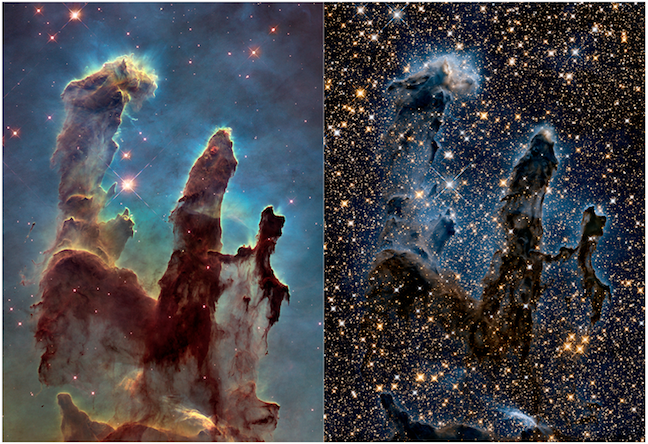
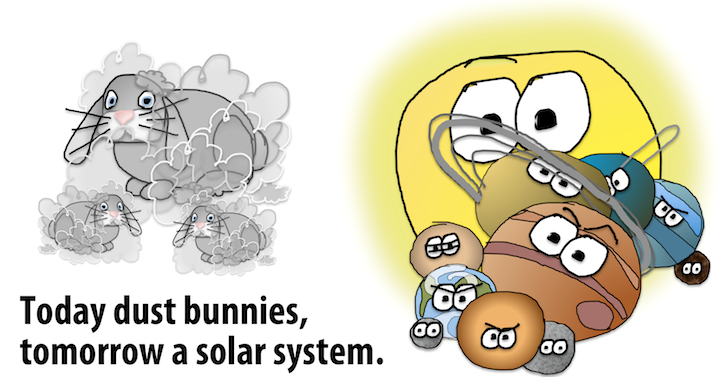
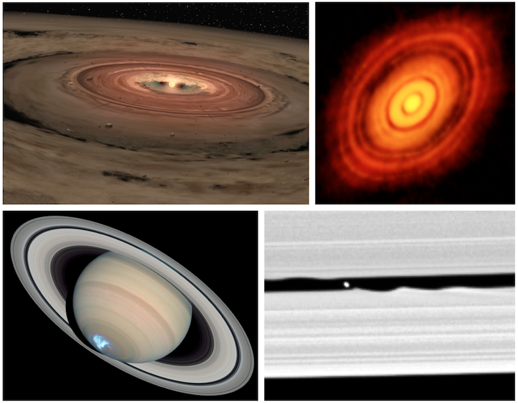
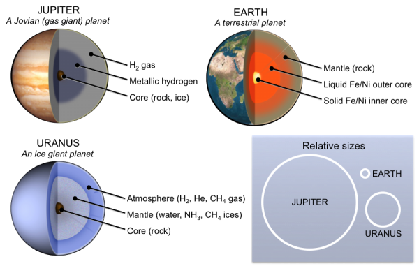
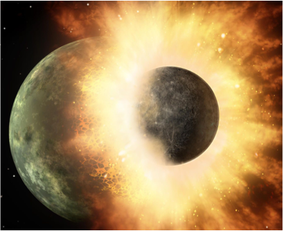

# The Origin of Earth and the Solar System

_Adapted from [Physical Geology, First University of Saskatchewan Edition](https://openpress.usask.ca/physicalgeology/) (Karla Panchuk)_

```{r figure-2-1, fig.cap='Earthrise, October 12, 2015. The Lunar Reconnaissance Orbiter Camera captured images of the lunar surface with Earth in the background. _Source: NASA Lunar Reconnaissance Orbiter Science Team (2015) Public Domain. [view source](https://earthobservatory.nasa.gov/IOTD/view.php?id=87233&amp;eocn=related_to&amp;eoci=related_image)_'}
knitr::include_graphics("figures/02-the-origin-of-earth-and-the-solar-system/figure-2-1.jpg")
```

<div class="textbox learning-objectives">

##### Learning Objectives {-}

After reading this chapter and answering the review questions at the end, you should be able to:

- Explain the big bang theory for the origin of the universe.
- Explain how clouds of gas floating in space can turn into stars and planets.
- Describe the types of objects that are present in our solar system, and why they exist where they do.
- Explain how Earth got its layered structure, water, and atmosphere.
- Explain how the moon formed.
- Compare and contrast our solar system with other planetary systems.

</div>

The story of how Earth came to be is a fascinating contradiction. On the one hand, many things had to go just right for Earth to turn out the way it did, and for life to develop. On the other hand, the formation of planets similar to Earth is an entirely predictable consequence of the physical and chemical processes taking place around stars. In fact, it has happened more than once.

This chapter starts Earth's story from the beginning — the _very_ beginning — to explain why, for billions of years, generations of stars had to be born, then die explosive deaths before Earth could exist. How stars form and burn, and affect the objects around them are fundamental to Earth's story, as is the rough neighbourhood in which Earth spent its early years.

## Starting with a Big Bang

According to the __big bang theory__, the universe blinked violently into existence 13.8 billion years ago. The big bang is often described as an explosion, but imagining it as an enormous fireball isn't accurate. The big bang started with a sudden expansion of energy and space from a single point. The kind of Hollywood explosion that might come to mind involves expansion of matter and energy _within_ space, but during the big bang, energy, space, and matter were _created_. In Figure \@ref(fig:figure-2-2) the pointed base of the universe "vessel" represents the big bang. Time advances moving up the diagram. The vessel gets wider as time progresses, reflecting the expansion of the universe.

```{r figure-2-2, fig.cap='The big bang. The universe began 13.8 billion years ago as a rapid expansion of space, energy, and matter. It continues to expand. Left: Timeline of the universe. The point at the base of the "vessel" represents the moment of the big bang. The vessel gets wider as time progresses, representing the expansion of the universe. Right: Mollwiede projection of the cosmic microwave background, a "fog" from when the universe was still very dense. Temperature variations correspond to clumping of matter in the early universe. _Source: Karla Panchuk (2018) CC BY 4.0 modified after Ryan Kaldari (2006) Public Domain [view source](https://commons.wikimedia.org/wiki/File:CMB_Timeline300_no_WMAP.jpg), derivative of NASA/WMAP Science Team (2006) Public Domain [view source](https://commons.wikimedia.org/wiki/File:CMB_Timeline75.jpg). CMB map by NASA/WMAP Science Team (2006) Public Domain [view source](https://map.gsfc.nasa.gov/media/121238/index.html). Click the image for data sources._'}

```

You might wonder how a universe can be created out of nothing. Creating a universe out of nothing is mostly beyond the scope of this chapter, but there is a way to think about it. The particles that make up the universe have opposites that cancel each other out, similar to the way that we can add the numbers 1 and -1 to get zero (also known as "nothing"). As far as the math goes, having zero is exactly the same as having a 1 and a -1. It is also exactly the same as having a 2 and a -2, a 3 and a -3, two -1s and a 2, and so on. In other words, _nothing_ is really the potential for _something_ if you divide it into its opposite parts.

### Composition of the Universe

In Figure \@ref(fig:figure-2-2), the "contents" of the vessel change as time progresses. A few minutes after the big bang, the universe was still too hot and dense to be anything but a sizzle of particles smaller than atoms. But as it expanded, it also cooled. Eventually particles that collided were able to stick together to form atoms, rather than being smashed apart again when other particles crashed into them. Those collisions produced hydrogen and helium, the most common elements in the universe.

For a long time after the big bang, clouds of hydrogen and helium atoms drifted about a dark universe. The "dark ages" (bottom of Figure \@ref(fig:figure-2-2)) were a time when the ingredients for stars existed, but stars themselves did not. It took approximately 500 million years for enough hydrogen atoms to clump together in clouds to allow the first stars to form and begin to shine.

### Looking Back to the Early Stages of the Big Bang

The notion of seeing the past is often used metaphorically when we talk about ancient events, but in this case it is meant literally. In our everyday experience, when we watch an event take place, we perceive that we are watching it as it unfolds in real time. In fact, this isn't true. To see the event, light from that event must travel to our eyes. Light travels very rapidly, but it does not travel instantly. If we were watching a digital clock 1 m away from us change from 11:59 a.m. to 12:00 p.m., we would actually see it turn to 12:00 p.m. three billionths of a second after it happened.

This isn't enough of a delay to cause us to be late for an appointment, but the universe is a very big place, and the "digital clock" in question is often much, much farther away. In fact, the universe is so big that it is convenient to describe distances in terms of __light years__, or the distance light travels in one year. What this means is that light from distant objects takes so long to get to us that we see those objects as they were at some considerable time in the past. For example, the star Proxima Centauri is 4.24 light years from the sun. If you viewed Proxima Centauri from Earth on January 1, 2018, you would actually see it as it appeared in early October 2013.

We now have tools that are powerful enough to look deep into space and see the arrival of light from early in the universe's history. Astronomers can detect light from approximately 380,000 years after the big bang is thought to have occurred. Physicists tell us that if the big bang happened, then particles within the universe would still be very close together at this time. They would be so close that light wouldn't be able to travel far without bumping into another particle and getting scattered in another direction. The effect would be to fill the sky with glowing fog, the "afterglow" from the formation of the universe.

In fact, this is exactly what we see when we look at light from 380,000 years after the big bang. The fog is referred to as the __cosmic microwave background__ (or CMB), and it has been carefully mapped throughout the sky. In Figure \@ref(fig:figure-2-2), the colourful patch at the base of the diagram represents the fog that is measured today as the CMB. Figure \@ref(fig:figure-2-2) (right) is a CMB map of the universe in Mollweide projection. This is a projection that is used to show Earth's geography on a flat surface. In this case, the map of the CMB represents a sphere surrounding Earth rather than what's beneath our feet.

Colour variations in the CMB map represent temperature variations. These variations translate to differences in the density at which matter was distributed in the early universe. The red patches are the highest density regions and the blue patches are the lowest density. Higher density regions represent the eventual beginnings of stars and planets. The CMB map in Figure \@ref(fig:figure-2-2) has been likened to a baby picture of the universe.

### The Universe is Still Expanding

The expansion that started with the big bang never stopped. It continues today, and we can see it happen by observing that large clusters of billions of stars, called __galaxies__, are moving away from us. (An exception is the Andromeda galaxy with which we are on a collision course.) The astronomer Edwin Hubble came to this conclusion when he observed that the light from other galaxies was red-shifted. The __red shift__ is a consequence of the Doppler effect. This refers to how we see waves when the object that is creating the waves is moving toward us or away from us.

Before looking at the Doppler effect as it pertains to light, it can be useful to see how it works on something more tangible. The duckling swimming in Figure \@ref(fig:figure-2-3) is generating waves as it moves through the water. It is generating waves that move forward as well as back, but notice that the ripples ahead of the duckling are closer to each other than the ripples behind the duckling. The distance from one ripple to the next is called the __wavelength__. The wavelength is shorter in the direction that the duckling is moving, and longer as the duckling moves away.

```{r figure-2-3, fig.cap='A duckling illustrates the Doppler effect in water. The ripples made in the direction the duckling is moving (blue lines) are closer together than the ripples behind the duckling (red lines). _Source: Karla Panchuk (2015) CC BY 4.0. Photo by M. Harkin (2013) CC BY 2.0 [view source](https://commons.wikimedia.org/wiki/File:Duck_and_ducklings_(8754923280).jpg)_'}
knitr::include_graphics("figures/02-the-origin-of-earth-and-the-solar-system/figure-2-3.png")
```

When waves are in air as sound waves rather than in water as ripples, the different wavelengths manifest as sounds with different pitches — the short wavelengths have a higher pitch, and the long wavelengths have a lower pitch. This is why an observer will hear a change in the pitch of a car's engine as the car races past.

For light waves, wavelength translates to colour. In the spectrum of light that we can see, shorter wavelengths are on the blue end of the spectrum, and longer wavelengths are on the red end of the spectrum. In Figure \@ref(fig:figure-2-4), the longer or shorter wavelengths of the water ripples at the top of the diagram reflect the longer or shorter wavelengths of light in the visible spectra below. Does this mean that galaxies look red because they are moving away from us? No, but the colour we see is shifted toward the red end of the spectrum and longer wavelengths.

```{r figure-2-4, fig.cap="Red shift in light from the supercluster BAS11 compared to the sun's light. Black lines represent wavelengths absorbed by atoms (mostly hydrogen and helium). For BAS11 the black lines are shifted toward the red end of the spectrum compared to the sun. _Source: Karla Panchuk (2018) CC BY 4.0, spectra by Georg Wiora (2011) CC BY-SA 2.5 [view source](https://commons.wikimedia.org/wiki/File:Redshift.svg)_"}
knitr::include_graphics("figures/02-the-origin-of-earth-and-the-solar-system/figure-2-4.png")
```

Notice that the sun's spectrum in the upper part of Figure \@ref(fig:figure-2-4) has black lines in it. The black lines are there because some colours are missing from the sun's light that reaches Earth. Different elements absorb light of specific wavelengths, and many of the black lines in Figure \@ref(fig:figure-2-4) represent colours that are absorbed by hydrogen and helium within the sun. This means the black lines are like a bar code that can tell us what a star is made of.

The lower spectrum in Figure \@ref(fig:figure-2-4) is the light coming from BAS11, an enormous cluster of approximately 10,000 galaxies located 1 billion light years away. The black lines represent the same elements as in the sun's spectrum, but they are shifted to the right toward the red end of the spectrum, because BAS11 is moving away from us as the universe continues to expand. To summarize, because almost all of the galaxies we can see have light that is red-shifted, it means they are all moving away from us. In fact, the farther away they are, the faster they are going. This is evidence that the universe is still expanding.

## Forming Planets from the Remnants of Exploded Stars

Only four elements account for 95% of Earth's mass: oxygen (O), magnesium (Mg), silicon (Si), and iron (Fe). Most of the remaining 5% comes from aluminum (Al), calcium (Ca), nickel (Ni), hydrogen (H), and sulphur (S). We know that the big bang made hydrogen, but where did the rest of the elements come from?

The answer is that the other elements were made by stars. Sometimes stars are said to "burn" their fuel, but burning is not what is going on within stars. The burning that happens when wood in a campfire is turned to ash and smoke is a chemical reaction — heat causes the atoms that were in the wood and in the surrounding atmosphere to exchange partners. Atoms group in different ways, but the atoms themselves do not change. What stars do is change the atoms. The heat and pressure within stars cause smaller atoms to smash together and fuse into new, larger atoms. For example, when hydrogen atoms smash together and fuse, helium is formed. Large amounts of energy are released when atoms fuse within stars, and this is what causes stars to shine. Stars can form large quantities of elements as heavy as iron during their normal burning process. Side reactions can form heavier elements in small amounts.

It takes larger stars to make elements as heavy as iron in large quantities. Our sun is an average star. After it uses up its hydrogen fuel to make helium, and some of that helium is fused to make small amounts of other elements, it will be at the end of its life. It will stop making new elements and will cool down and bloat until its middle reaches the orbit of Mars. In contrast, large stars end their lives in spectacular fashion. They explode as supernovae, casting off newly formed atoms into space, and triggering side reactions to make even more heavy atoms. It took many generations of stars creating heavier elements and casting them into space before heavier elements were abundant enough for planets like Earth to form.

Until recently, astronomers have only been able to see stars that already contain heavier elements in small amounts, but not the first-generation stars that started out before any of the heavier elements were produced. That changed in 2015 when it was announced that a distant galaxy called CR7 had been found that contained stars made only of hydrogen and helium. The galaxy is so far away that it shows us a view of the universe from approximately 800 million years after the big bang. Since then, more galaxies like CR7 have been discovered.

## How to Build a Solar System

A __solar system__ consists of a collection of objects orbiting one or more central stars. All solar systems start out the same way. They begin in a cloud of gas and dust called a __nebula__. Nebulae are some of the most beautiful objects that have been photographed in space. They have vibrant colours from the gases and dust they contain, and brilliant twinkling from the many stars that have formed within them (Figure \@ref(fig:figure-2-5)). The gas consists largely of hydrogen and helium, and the dust consists of tiny mineral grains, ice crystals, and organic particles.

```{r figure-2-5, fig.cap='The Pillars of Creation within the Eagle Nebula viewed in visible light (left) and near infrared light (right). Near infrared light captures heat from stars and allows us to view stars that would otherwise be hidden by dust. This is why the picture on the right appears to have more stars than the picture on the left. _Source: NASA, ESA, and the Hubble Heritage Team (STScI/AURA) (2015) Public Domain. [view source](http://hubblesite.org/image/3474/news_release/2015-01)_'}

```

### Step 1: Collapse a Nebula

A solar system begins to form when a small patch within a nebula (small by the standards of the universe, that is) begins to collapse upon itself. Exactly how this starts isn't clear, although it might be triggered by the violent behaviour of nearby stars as they progress through their life cycles. Energy and matter released by these stars might compress the gas and dust in nearby neighbourhoods within the nebula.

Once it is triggered, the collapse of gas and dust within that patch continues for two reasons. One of those reasons is that gravitational force pulls gas molecules and dust particles together. But early in the process, those particles are very small, so the gravitational force between them isn't strong. So how do they come together? The answer is that dust first accumulates in loose clumps for the same reason dust bunnies form under the bed: static electricity. Given the role of dust bunnies in the early history of the solar system, one might speculate that an accumulation of dust bunnies poses a substantial risk to one's home (Figure \@ref(fig:figure-2-6)). In practice, however, this is rarely the case.

```{r figure-2-6, fig.cap="Public service announcement. If you don't think housekeeping is important, then you don't understand the gravity of the situation. _Source: Karla Panchuk (2018) CC BY 4.0. Planets modified after NASA/JPL (2008) Public Domain. [view source](https://www.jpl.nasa.gov/spaceimages/details.php?id=pia10969)_"}

```

### Step 2: Make a Disk with a Star at Its Centre

As the small patch within a nebula condenses, a star begins to form from material drawn into the centre of the patch, and the remaining dust and gas settle into a __protoplanetary disk__ that rotates around the star. The disk is where planets will eventually form. Figure \@ref(fig:figure-2-7) (upper left) is an artist's impression of a protoplanetary disk, and Figure \@ref(fig:figure-2-7) (upper right) is an actual protoplanetary disk surrounding the star HL Tauri. Notice the dark rings within the HL Tauri protoplanetary disk. These are gaps formed by the collection of dust and debris by incipient planets, called __protoplanets__, as they orbit the star. There is an analogy for this in our own solar system, because the dark rings are akin to the gaps in the rings of Saturn (Figure \@ref(fig:figure-2-7), lower left), where moons can be found (Figure \@ref(fig:figure-2-7), lower right).

```{r figure-2-7, fig.cap="Protoplanetary disks and Saturn's rings. Upper left: Artist\'s impression of a protoplanetary disk containing gas and dust, surrounding a new star. Upper right: A photograph of the protoplanetary disk surrounding HL Tauri. The dark rings within the disk are thought to be gaps where newly forming planets are sweeping up dust and gas. Lower left: A photograph of Saturn showing similar gaps within its rings. The bright spot at the bottom is an aurora, similar to the northern lights on Earth. Lower right: a close-up view of a gap in Saturn's rings showing a moon as a white dot. _Source: Upper left- NASA/JPL-Caltech (2008) Public Domain [view source](https://www.nasa.gov/mission_pages/spitzer/multimedia/20080313c.html); Upper right- ALMA (ESO/NAOJ/NRAO) (2014) CC BY 4.0 [view source](http://www.eso.org/public/usa/images/eso1436a/); Lower left- NASA, ESA, J. Clarke (Boston University), and Z. Levay (STScI) (2005) Public Domain [view source](http://hubblesite.org/image/1656/news_release/2005-06); Lower right- NASA/JPL/Space Science Institute (2005) Public Domain [view source](https://www.nasa.gov/mission_pages/cassini/media/cassini-051005.html)_"}

```

### Step 3: Build Some Planets

In general, planets can be classified into three categories based on what they are made of (Figure \@ref(fig:figure-2-8)). __Terrestrial planets__ are those planets like Earth, Mercury, Venus, and Mars that have a core of metal surrounded by rock. __Jovian planets __(also called __gas giants__) are those planets like Jupiter and Saturn that consist predominantly of hydrogen and helium. __Ice giants__ are planets such as Uranus and Neptune that consist largely of water ice, methane (CH~4~) ice, and ammonia (NH~3~) ice, and have rocky cores. Often, the ice giant planets Uranus and Neptune are grouped with Jupiter and Saturn as gas giants; however, Uranus and Neptune are very different from Jupiter and Saturn.

```{r figure-2-8, fig.cap='Three types of planets. Jovian (or gas giant) planets such as Jupiter consist mostly of hydrogen and helium. They are the largest of the three types. Ice giant planets such as Uranus are the next largest. They contain water, ammonia, and methane ice, and have rocky cores. Terrestrial planets such as Earth are the smallest, and they have metal cores covered by rocky mantles. _Source: Karla Panchuk (2015) CC BY 4.0. Click the image for more attributions._'}

```

These three types of planets are not mixed together randomly within our solar system. Instead they occur in a systematic way, with terrestrial planets closest to the sun, followed by the Jovian planets and then the ice giants (Figure \@ref(fig:figure-2-9)). Smaller __solar system__ objects follow this arrangement as well. The__ asteroid belt__ contains bodies of rock and metal. Bodies ranging from metres to hundreds of metres in diameter are classified as __asteroids__, and smaller bodies are referred to as __meteoroids__. In contrast, the__ Kuiper belt __(_Kuiper_ rhymes with _piper_), and the __Oort cloud__ (_Oort_ rhymes with _sort_), which are at the outer edge of the solar system, contain bodies composed of large amounts of ice in addition to rocky fragments and dust.

```{r figure-2-9, fig.cap='Our solar system. Top: The solar system shown with distances to scale. Distances are in astronomical units (AU), where 1 AU is the average distance from Earth to the sun. The edge of the Kuiper belt extends to 50 AU (7.5 billion km), but this distance is minuscule compared to the size of the solar system as a whole, which extends to the edge of the Oort cloud, thought to be 15 trillion km away. Bottom: Solar system with the sun and planets to scale. The gas giants are the largest planets, followed by the ice giants, and then the terrestrial planets. Note that the planets in this diagram likely do not reflect the entire population of planets in our solar system because evidence suggests that large planets are present beyond the Kuiper belt. _Source: Karla Panchuk (2018) CC BY-NC-SA 4.0, Milky Way photo by R@pp (2017) CC BY-NC-SA 2.0 [view source,](https://flic.kr/p/TM5Ssm) planet photographs courtesy of NASA. Click the image for planet photo sources and attributions._'}

```

Part of the reason for this arrangement is the __frost line__ (also referred to as the __snow line__). The frost line marks the division between the inner part of the protoplanetary disk closer to the sun, where it was too hot to permit anything but silicate minerals and metal to crystalize, and the outer part of the disk farther from the sun, where it was cool enough to allow ice to form. As a result, the objects that formed in the inner part of the protoplanetary disk consist largely of rock and metal, while the objects that formed in the outer part consist largely of gas and ice. The young sun blasted the solar system with raging __solar winds __(winds made up of energetic particles), which helped to drive lighter molecules toward the outer part of the protoplanetary disk.

#### Rules of the Accretion Game

The objects in our solar system formed by __accretion__. Early in this process, particles collected in fluffy clumps because of static electricity. As the clumps grew larger, gravity became more important and collected clumps into solid masses, and solid masses into larger and larger bodies. If you were one of these bodies in the early solar system, and participating in the "accretion game" with the goal of becoming a planet, you would have to follow some key rules:

- Explain the big bang theory for the origin of the universe.
- Explain how clouds of gas floating in space can turn into stars and planets.
- Describe the types of objects that are present in our solar system, and why they exist where they do.
- Explain how Earth got its layered structure, water, and atmosphere.
- Explain how the moon formed.
- Compare and contrast our solar system with other planetary systems.

You would also have to watch out for some dangers:

- Explain the big bang theory for the origin of the universe.
- Explain how clouds of gas floating in space can turn into stars and planets.
- Describe the types of objects that are present in our solar system, and why they exist where they do.
- Explain how Earth got its layered structure, water, and atmosphere.
- Explain how the moon formed.
- Compare and contrast our solar system with other planetary systems.

#### Winners and Losers

The outcome of the game is evident in Figure \@ref(fig:figure-2-9). Today eight official winners are recognized, with Jupiter taking the grand prize, followed closely by Saturn. Both planets have trophy cases with more than 60 moons each, and each has a moon that is larger than Mercury. Prior to 2006, Pluto was also counted a winner, but in 2006 a controversial decision revoked Pluto's planet status. The reason was a newly formalized definition of a planet, which stated that an object can only be considered a planet if it is massive enough to have swept its orbit clean of other bodies. Pluto is situated within the icy clutter of the Kuiper belt, so it does not fit this definition.

Pluto's supporters have argued that Pluto should have been grandfathered in, given that the definition came after Pluto was declared a planet, but to no avail. Pluto has not given up, and on July 13, 2015, it launched an emotional plea with the help of the NASA's New Horizons probe. New Horizons sent back images of Pluto's heart (Figure \@ref(fig:figure-2-10)). On closer inspection, Pluto's heart was discovered to be broken.

```{r figure-2-10, fig.cap="Photographs of Pluto. Left: The heart-shaped region called Tombaugh Regio is outlined. This region is named after Pluto's discoverer Clyde Tombaugh. Right: False-colour images show compositional variations in Tombaugh Regio. _Source: Karla Panchuk (2015) CC BY 4.0. Left photo- NASA/APL/SwRI (2015) Public Domain [view source](https://www.nasa.gov/feature/new-horizons-spacecraft-displays-pluto-s-big-heart-0), Right photo- NASA/APL/SwRI (2015) Public Domain. [view source](https://www.nasa.gov/image-feature/pluto-and-charon-shine-in-false-color)._"}

```

###  The Accretion Game and the Solar System Today

The rules and dangers of the planet-forming game help to explain many features of our solar system today.

- Explain the big bang theory for the origin of the universe.
- Explain how clouds of gas floating in space can turn into stars and planets.
- Describe the types of objects that are present in our solar system, and why they exist where they do.
- Explain how Earth got its layered structure, water, and atmosphere.
- Explain how the moon formed.
- Compare and contrast our solar system with other planetary systems.

## Earth's First 2 Billion Years

If you were to get into a time machine and visit Earth shortly after it formed (around 4.5 billion years ago), you would probably regret it. Large patches of Earth's surface would still be molten, which would make landing your time machine very dangerous indeed. If you happened to have one of the newer time-machine models with hovering capabilities and heat shields, you would still face the inconvenience of having nothing to breathe but a tenuous wisp of hydrogen and helium gas, and depending on how much volcanic activity was going on, volcanic gases such as water vapour and carbon dioxide. Some ammonia and methane might be thrown in just to make it interesting, but there would be no oxygen. Assuming you had the foresight to purchase the artificial atmosphere upgrade for your time machine, it would all be for naught if you materialized just in time to see an asteroid, or worse yet another planet, bearing down on your position. The moral of the story is that early Earth was a nasty place, and a time machine purchase is not something to take lightly.

Why was early Earth so nasty?

### Earth Was Hot

Earth's heat comes from the decay of radioactive elements within Earth, as well as from processes associated with Earth's formation. Formation processes contributed heat in the following ways:

- Explain the big bang theory for the origin of the universe.
- Explain how clouds of gas floating in space can turn into stars and planets.
- Describe the types of objects that are present in our solar system, and why they exist where they do.
- Explain how Earth got its layered structure, water, and atmosphere.
- Explain how the moon formed.
- Compare and contrast our solar system with other planetary systems.

Heating had an important consequence for Earth's structure. As Earth grew, it collected a mixture of rocky silicate mineral grains as well as iron and nickel. These materials were scattered throughout Earth. That changed when Earth began to heat up: it got so hot that the metals melted and trickled down through the rocky silicate material toward Earth's centre, becoming Earth's core. The silicate material became Earth's crust and mantle. In other words, Earth unmixed itself. The separation of silicate minerals and metals into a rocky outer layer and a metallic core, respectively, is called __differentiation__. Friction from metal melts moving through Earth caused it to heat up even more.

Earth's high temperature early in its history also means that early tectonic processes were accelerated compared to today, and Earth's surface was more geologically active.

### Earth Was Bombarded by Objects from Space

Although Earth had swept up a substantial amount of the material in its orbit as it was accreting, unrest within the solar system caused by changes in the orbits of Saturn and Jupiter was still sending many large objects on cataclysmic collision courses with Earth. The energy from these collisions repeatedly melted and even vaporized minerals in the crust, and blasted gases out of Earth's atmosphere. Very old scars from these collisions are still detectable, although we have to look carefully to see them. For example, the oldest impact site discovered is the 3 billion year old Maniitsoq "crater" in west Greenland, although there is no crater to see. What is visible are rocks that were 20 km to 25 km below Earth's surface at the time of the impact, but which nevertheless display evidence of deformation that could only be produced by intense, sudden shock.

The evidence of the very worst collision that Earth experienced is not subtle at all. In fact, you have probably looked directly at it hundreds of times already, perhaps without realizing what it is. That collision was with a planet named Theia, which was approximately the size of Mars. Not long after Earth formed, Theia struck Earth (Figure \@ref(fig:figure-2-11)). When Theia slammed into Earth, Theia's metal core merged with Earth's core, and debris from the outer silicate layers was cast into space, forming a ring of rubble around Earth. The material within the ring coalesced into a new body in orbit around Earth, giving us our moon. Remarkably, the debris may have coalesced in 10 years or fewer! This scenario for the formation of the moon is called the __giant impact hypothesis__.

```{r figure-2-11, fig.cap="Artist's impression of a collision between planets. A similar collision between Earth and the planet Theia might have given us our moon. _Source: NASA/ JPL-Caltech (2009) Public Domain. [view source](https://www.nasa.gov/multimedia/imagegallery/image_feature_1454.html)._"}

```

### Today's Atmosphere Took a Long Time to Develop

Earth's first experiment with having an atmosphere did not succeed. It started out with a thin veil of hydrogen and helium gases that came with the material it accreted. But hydrogen and helium are very light gases, and they bled off into space.

Earth's second experiment with having an atmosphere went much better. Volcanic eruptions built up the atmosphere by releasing gases. The most common volcanic gases are water vapour and carbon dioxide (CO~2~), but volcanoes release a wide variety of gases. Other important contributions include sulphur dioxide (SO~2~), carbon monoxide (CO), hydrogen sulphide (H~2~S), hydrogen gas, and methane (CH~4~). Meteorites and comets also brought substantial amounts of water and nitrogen to Earth. It is not clear what the exact composition of the atmosphere was after Earth's second experiment, but carbon dioxide, water vapour, and nitrogen were likely the three most abundant components.

One thing we can say for sure about Earth's second experiment is that there was effectively no __free oxygen__ (O~2~, the form of oxygen that we breathe) in the atmosphere. We know this in part because prior to 2 billion years ago, there were no rocks stained red from oxidized iron minerals. Iron minerals were present, but not in oxidized form. At that time, O~2~ was produced in the atmosphere when the sun's ultraviolet rays split water molecules apart. However, chemical reactions removed the oxygen as quickly as it was produced.

It wasn't until well into Earth's third experiment — life — that the atmosphere became oxygenated. Photosynthetic organisms used the abundant CO~2~ in the atmosphere to manufacture their food, and released O~2~ as a by-product. At first all of the oxygen was consumed by chemical reactions as before, but eventually the organisms released so much O~2~ that it overwhelmed the chemical reactions. Oxygen began to accumulate in the atmosphere, although present levels of 21% oxygen didn't occur until about 350 million years ago. Today the part of our atmosphere that isn't oxygen consists largely of nitrogen (78%).

The oxygen-rich atmosphere on our planet is life's signature. If geologic processes were the only ones controlling our atmosphere, it would consist mostly of carbon dioxide, like the atmosphere of Venus. It is an interesting notion (or a disconcerting one, depending on your point of view) that for the last 2 billion years the light reflected from our planet has been beaming a bar code out to the universe, similar to the ones in Figure \@ref(fig:figure-2-4), except ours says "oxygen." For 2 billion years, our planet has been sending out a signal that could cause an observer from another world to say, "That's odd… I wonder what's going on over there."

## Are There Other Earths?

As of January 2018, 6,355 possible __exoplanets__- extrasolar planets, or planets outside of our solar system- have been detected by preliminary tests. Further tests have confirmed that 3,726 of those candidates are indeed planets. If "other Earths" are defined as planets where we could walk out of a spaceship with no equipment other than a picnic basket, and enjoy a pleasant afternoon on a grassy slope near a stream, then it remains to be seen whether any of these planets fit the description. On the other hand, if "other Earths" refers to rocky worlds approximately Earth's size, and orbiting within their star's __habitable zone__ (the zone in which liquid water, and potentially life, can exist), then there is cautious optimism that we have found at least 53 such worlds.

Part of the uncertainty about the 53 possible Earth-like worlds is related to their composition. We don't yet know their composition; however, it is tempting to conclude that they are rocky because they are similar in size to Earth. Remember the rules of the accretion game: you can only begin to collect gas once you are a certain size, and how much matter you collect depends on how far away from the sun you are. Given how large our gas giant and ice giant planets are compared to Earth, and how far away they are from the sun, we would expect that a planet similar in size to Earth, and a similar distance from its star, should be rocky.

But it isn't quite as simple as that. We are finding that the rules to the accretion game can result in planetary systems very different from our own. For example, in the planetary systems we have observed, it is common to have planets larger than Earth orbiting closer to their star than Mercury does to the sun. Planets as large as Jupiter are rare, and where large planets do exist, they are much closer to their star than Jupiter is to the sun. To summarize, we need to be cautious about drawing conclusions from our own solar system, just in case we are basing those conclusions on something truly unusual.

On the other hand, the seemingly unique features of our solar system would make planetary systems like ours difficult to spot. One of the ways exoplanets are detected is by measuring the brightness of stars, and looking for tiny variations in brightness that could be caused by a planet passing between the star it orbits and the instrument observing the star. Small planets are harder to detect because they block less of a star's light than larger planets. Larger planets farther from a star, like our gas giant planets, are difficult to spot because they don't go past the star as frequently. For example, Jupiter goes around the sun once every 12 years. If someone were observing our solar system, they might have to watch for 12 years to see Jupiter go past the sun once. For Saturn, they might have to watch for 30 years.

### If Habitable Zone Planets Are Terrestrial, Could We Live There?

The operational definition of "other Earths" involving a terrestrial composition, a size constraint of one to two times that of Earth, and location within a star's habitable zone, does not preclude worlds incapable of supporting life as we know it. By those criteria, Venus is an "other Earth," albeit right on the edge of the habitable zone for our sun. Venus is much too hot for us, with a constant surface temperature of 465°C (lead melts at 327°C). Its atmosphere is almost entirely carbon dioxide, and the atmospheric pressure at its surface is 92 times higher than on Earth. Any liquid water on its surface boiled off long ago. Yet the characteristics that make Venus a terrible picnic destination aren't entirely things we could predict from its distance from the sun. They depend in part on the geochemical evolution of Venus- at one time Venus might have been a lot more like a youthful Earth. These are the kinds of things we won't know about until we can look carefully at the atmospheres and compositions of habitable-zone exoplanets.

<div class="textbox">

##### Keep Up-To-Date on the Exoplanet Count

Look up the latest count of potential and confirmed exoplanets in the [Extrasolar Planets Catalog](http://exoplanet.eu/catalog/).

Look up the latest number of potentially habitable exoplanets in the [Habitable Exoplanets Catalog](http://phl.upr.edu/projects/habitable-exoplanets-catalog).

</div>

## Summary

The topics covered in this chapter can be summarized as follows:

### Starting With a Big Bang

The universe began 13.8 billion years ago when energy, matter, and space expanded from a single point. Evidence for the big bang is the cosmic "afterglow" from when the universe was still very dense, and red-shifted light from distant galaxies, which tell us the universe is still expanding.

### Forming Planets from the Remnants of Exploding Stars

The big bang produced hydrogen, helium, but heavier elements come from nuclear fusion reactions in stars. Large stars make elements such as silicon, iron, and magnesium, which are important in forming terrestrial planets. Large stars explode as supernovae and scatter the elements into space.

### How to Build a Solar System

Solar systems begin with the collapse of a cloud of gas and dust. Material drawn to the centre forms a star, and the remainder forms a disk around the star. Material within the disk clumps together to form planets. In our solar system, rocky planets are closer to the sun, and ice and gas giants are farther away. This is because temperatures near the sun were too high for ice to form, but silicate minerals and metals could solidify.

### Earth's First 2 Billion Years

Early Earth was heated by radioactive decay, collisions with bodies from space, and gravitational compression. Heating caused molten metal to sink to Earth's centre and form a core, and silicate minerals to form the mantle and crust. A collision with a planet the size of Mars knocked debris into orbit around Earth, and the debris coalesced into the moon. Earth's atmosphere is the result of volcanic degassing, contributions by comets and meteorites, and photosynthesis.

### Are There Other Earths?

The search for exoplanets has identified 53 planets that are similar in size to Earth and within the habitable zone of their stars. These are thought to be rocky worlds like Earth, but the compositions of these planets are not known for certain.

## Chapter Review Questions

1. How can astronomers view events that happened in the universe's distant past?

2. In this image of three spectra, one is from the sun, and the other two are from galaxies. One of the galaxies is the Andromeda galaxy. Which spectrum is from Andromeda?

```{r fig-spectra-sun-two-galaxies, fig.cap='Spectra for the sun and two galaxies. Source: Karla Panchuk (2015) CC BY 4.0'}
knitr::include_graphics("https://openpress.usask.ca/app/uploads/sites/29/2017/05/spectra.png")
```

3. Astronomers looking for some of the earliest stars in the universe were surprised to find a planetary system called HIP 11952, which existed 12.8 billion years ago. This was very early in the universe's history, when stars still consisted largely of hydrogen and helium. Do you think there were terrestrial planets in this system? Why or why not?

4. Summarize the trends in size and composition of objects in the solar system.

5. What is the frost line, and what does it help to explain?

6. Why is Pluto not considered a planet?

7. What is differentiation?

8. The exoplanet Kepler-452b is within the habitable zone of its star. In our solar system, planets a similar distance from the Sun are terrestrial planets. Why can we not say for certain that Kepler-452b's distance from its star means it is a terrestrial planet?

9. Of the planetary systems discovered thus far, none are exactly like our solar system. Does this mean our solar system is unique in the universe?

## Answers to Chapter Review Questions

1. To see an event, light from that event must reach our eyes. Light travels very quickly (about 300,000,000 m/s), but the universe is very, very large. Depending on how far away the event was, it could take billions of years for light to travel from the event to our eyes so we can see it. Astronomers take advantage of this fact to view the universe's past.

2. B is the spectrum from the Andromeda galaxy. We know that one spectrum represents the sun, which is not moving toward or away from us. (Our orbit is not perfectly circular, but the small eccentricity is not a factor in this comparison.) We know that the Andromeda galaxy is on a collision course with us, so it is the exception to the rule that galaxies are moving away from us, and their light is red-shifted. That means the spectrum B which is shifted furthest to the left (blue-shifted) is Andromeda, and spectrum A which is furthest to the right (red-shifted) is a galaxy moving away from us. That means C is the sun.

3. The planetary system consisted of two Jupiter-sized gas giant planets. Gas giant planets contain large amounts of hydrogen, and hydrogen was plentiful in the early universe. In contrast, terrestrial planets have heavier elements, especially silica, iron, magnesium, and nickel, that had yet to be manufactured by stars. Those elements were not present in sufficient abundance to form terrestrial planets until much later.

4. Closest to the sun we find the small, rocky, terrestrial planets with metal cores. Further out are the gas giant planets, which are the largest in the solar system. They consist mostly of hydrogen, and have cores of rock and ice. Beyond the gas giant planets are the ice giant planets, which are next largest. They have a mantle of ice (not just water ice but ammonia and methane ice), and a rocky core. Smaller objects in the solar system include rocky bodies within the asteroid belt between Mars and Jupiter, and bodies of ice and dust in the Kuiper belt and Oort cloud beyond Neptune.

5. The frost line marks the distance from the sun beyond which temperatures were cool enough to allow ice to form. This helps to explain why the terrestrial planets are closer to the sun, and the Jovian and ice giant planets farther away. Mineral grains could solidify and begin to accrete closer to the sun, forming terrestrial planets, because they have higher melting points. In contrast, water vapour, methane, and ammonia had to be farther from the sun before they could freeze and begin to accrete.

6. Planets are defined as having cleared their orbits of debris. Pluto is located within the Kuiper belt, so it shares its orbit with other objects. There are two other criteria in the definition of a planet: planets in our solar system must orbit the sun, and they must have a spherical shape. Pluto satisfies both these criteria, but sadly the people deciding whether or not Pluto should be a planet are not amenable to a "best two out of three" compromise.

7. Differentiation is the separation of materials within a planet such that dense materials sink to the core. In Earth's case, the denser materials are iron and nickel.

8. The fact that we have terrestrial planets close to the sun makes sense in terms of the frost line, but it does not seem to be a hard-and-fast rule in other planetary systems. Therefore, we can't conclude from Kepler-452b's position alone that it is a terrestrial planet.

9. The rules of the accretion game mean that there are many complex interactions, so even a small difference in the starting conditions or in how the game goes in the beginning could have major implications in the end. For that reason, we shouldn't expect to find a planetary system that matches ours in every minute detail. However, just because we haven't found a similar planetary system does not mean one does not exist. Our planet-finding methods are biased toward discovering large planets orbiting close to their stars, whereas our solar system has small planets close to the sun and larger ones farther away. That doesn't mean our methods won't eventually turn up a system like ours, just that they are more likely to turn up systems that are different.

## References

European Space Agency (2015). _Planck reveals first stars were born late_. [Visit website](http://www.esa.int/Our_Activities/Space_Science/Planck/Planck_reveals_first_stars_were_born_late)

Knop, R. (2010). _The History of the Universe_. [Visit blog](http://galacticinteractions.scientopia.org/2010/08/02/the-history-of-the-universe/)

Lawrence, C. R. (2015, March). Planck 2015 Results. Paper presented to the Astrophysics Subcommittee, NASA HQ. [View slides](https://smd-prod.s3.amazonaws.com/science-green/s3fs-public/mnt/medialibrary/2015/04/08/CRL_APS_2015-03-18_compressed2.pdf)

Pilipenko, S. V. (2013). Paper-and-pencil cosmological calculator. [arXiv:1303.5961v1](https://arxiv.org/abs/1303.5961v1) [astro-ph.CO]

Royal Astronomical Society (2016, June 28). CR7 is not alone—A team of super bright galaxies in the early universe. _Phys.org_ [Visit website](https://phys.org/news/2016-06-cr7-alonea-team-super-bright.html)

Sobral, D., Matthee, J.,  Darvish, B., Schaerer, D., Mobasher, B., Röttgering, H., Santos, S., and Hemmati, S. (2015). Evidence for PopIII-like stellar populations in the most luminous Lyman-alpha emitters at the epoch of re-ionisation: spectroscopic confirmation. _The Astrophysical Journal 808_(2) doi: [10.1088/0004-637x/808/2/139](https://doi.org/10.1088%2F0004-637x%2F808%2F2%2F139).
