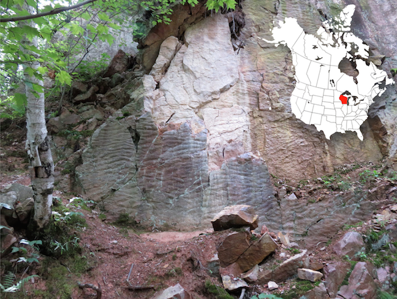

# The Rock Cycle

_Adapted from [Physical Geology, First University of Saskatchewan Edition](https://openpress.usask.ca/physicalgeology/) (Karla Panchuk) and [Physical Geology](https://opentextbc.ca/geology/) (Steven Earle)_

```{r figure-6-1, fig.cap='A petrified beach near Rock Springs, Wisconsin, U. S. A. The wrinkled face of this vertical cliff displays ripples from an ancient beach. Flowing water moved sand grains to form ripples, and over time the sand was transformed into a solid sedimentary rock. The petrified beach was buried deeper and deeper, and the higher pressures and temperatures caused the sand grains to lose their individual boundaries and merge together. Thus, the sedimentary rock was transformed into a different type of rock, called a metamorphic rock. _Source: Karla Panchuk (2017) CC BY-SA 4.0. Click the image for more attributions._'}

```

<div class="textbox learning-objectives">

##### Learning Objectives {-}

After reading this chapter and answering the _Review Questions_ at the end, you should be able to:

- Explain what a rock is.
- Summarize the main characteristics of igneous, sedimentary, and metamorphic rocks.
- Describe the rock cycle and the types of processes that lead to the formation of igneous, sedimentary, and metamorphic rocks.
- Explain why there is an active rock cycle on Earth.

</div>

## What Is A Rock?

A __rock__ is a solid mass of geological materials. Geological materials include individual mineral crystals, inorganic non-mineral solids like glass, pieces broken from other rocks, and even fossils. The geological materials in rocks may be inorganic, but they can also include organic materials such as the partially decomposed plant matter preserved in coal. A rock can be composed of only one type of geological material or mineral, but many are composed of several types. Figure \@ref(fig:figure-6-2) shows a rock made of three different kinds of minerals.

Rocks are grouped into three main categories based on how they form. __Igneous rocks__ form when melted rock cools and solidifies. __Sedimentary rocks__ form when fragments of other rocks are buried, compressed, and cemented together; or when minerals precipitate from solution, either directly or with the help of an organism. __Metamorphic rocks__ form when heat and pressure alter a pre-existing rock. Although temperatures can be very high, metamorphism does not involve melting of the rock.

```{r figure-6-2, fig.cap='This close-up view of the igneous rock pegmatite shows black biotite crystals, colourless quartz crystals, and pink potassium feldspar crystals. Crystals are mm to cm in scale. _Source: R. Weller/ Cochise College (2011) Permission for non-commercial educational use. (labels added) [view source](http://skywalker.cochise.edu/wellerr/rocks/igrx/pegmatite7.htm)_'}

```

## The Rock Cycle

The rock components of the crust are slowly but constantly being changed from one form to another. The processes involved are summarized in the __rock cycle__ (Figure \@ref(fig:figure-6-3)). The rock cycle is driven by two forces:

1. Earth’s internal heat, which causes material to move around in the core and mantle, driving plate tectonics.
1. The __hydrological cycle__- movement of water, ice, and air at the surface. The hydrological cycle is powered by the sun.

```{r figure-6-3, fig.cap='The rock cycle describes processes that form the three types of rock: igneous, sedimentary, and metamorphic. These same processes can turn one type of rock into another. _Source: Karla Panchuk (2017) CC BY-SA 4.0. Click the image for more attributions._'}

```

The rock cycle is still active on Earth because our core is hot enough to keep the mantle moving, the atmosphere is relatively thick, and there is liquid water. On some other planets or their satellites (e.g., Mercury), the rock cycle is virtually dead because the core is no longer hot enough to drive mantle convection, and there is no atmosphere or liquid water.

We can start anywhere we like to describe the rock cycle, but it’s convenient to start with magma. __Magma__ is melted rock located within the Earth. Rock can melt at between about 800 °C and 1300 °C, depending on the minerals in the rock, and the pressure the rock is under. If it cools slowly within the Earth (over centuries to millions of years), magma forms __intrusive igneous rocks__. If magma erupts onto the surface, we refer to it as __lava__. Lava cools rapidly on Earth's surface (within seconds to years) and forms __extrusive igneous rocks __(Figure \@ref(fig:figure-6-4)).^[Remember the difference between intrusive and extrusive igneous rocks by recalling that <span style="text-decoration: underline">__IN__</span>trusive rocks form with<span style="text-decoration: underline">__IN__</span> the Earth, and __<span style="text-decoration: underline">EX</span>__trusive rocks form when lava <span style="text-decoration: underline">__EX__</span>its the Earth's crust.]

```{r figure-6-4, fig.cap='Lava flowing from Kīlauea Volcano, Hawai`i. _Source: J. D. Griggs, U. S. Geological Survey (1985) Public Domain [view source](https://volcanoes.usgs.gov/vsc/glossary/lava.html)_'}
knitr::include_graphics("figures/06-the-rock-cycle/figure-6-4.jpg")
```

Mountain building lifts rocks upward where they are acted upon by weathering. Weathering includes chemical processes that break rocks apart, as well as physical processes. Figure \@ref(fig:figure-6-5) shows the result of rocks in mountains being broken apart when water gets into cracks, freezes, and forces the cracks wider. Uplift through mountain building is how rocks once buried deep within Earth can be exposed at Earth's surface.

```{r figure-6-5, fig.cap='Mountains being broken apart by the wedging action of ice near La Madaleta Glacier, Spain. _Source: Luis Paquito (2006) CC BY-SA 2.0 [view source](https://flic.kr/p/n5bk1) _'}

```

The weathering products — mostly small rock and mineral fragments — are eroded, transported, and then deposited as __sediments__. Transportation and deposition occur through the action of glaciers, streams, waves, wind, and other agents. Figure \@ref(fig:figure-6-6) shows transportation of fine-grained sediment particles by wind during the Great Depression in the 1930s.

```{r figure-6-6, fig.cap='Wind transports sediment in a dust storm near Okotoks, Alberta, Canada in July of 1933. _Source: Glenbow Museum Archives, File Number NA-2199-1 (1933) Public Domain [view source](http://ww2.glenbow.org/search/archivesPhotosResults.aspx?AC=GET_RECORD&amp;XC=/search/archivesPhotosResults.aspx&amp;BU=&amp;TN=IMAGEBAN&amp;SN=AUTO22774&amp;SE=1569&amp;RN=0&amp;MR=10&amp;TR=0&amp;TX=1000&amp;ES=0&amp;CS=0&amp;XP=&amp;RF=WebResults&amp;EF=&amp;DF=WebResultsDetails&amp;RL=0&amp;EL=0&amp;DL=0&amp;NP=255&amp;ID=&amp;MF=WPEngMsg.ini&amp;MQ=&amp;TI=0&amp;DT=&amp;ST=0&amp;IR=27264&amp;NR=0&amp;NB=0&amp;SV=0&amp;BG=&amp;FG=&amp;QS=ArchivesPhotosSearch&amp;OEX=ISO-8859-1&amp;OEH=ISO-8859-1)_'}

```

Sediments are deposited in stream channels, lakes, deserts, and the ocean. Some depositional settings result in characteristic sedimentary structures, such as the ripples that formed when flowing water moved sand along the bottom of the South Saskatchewan River (Figure \@ref(fig:figure-6-7)).

```{r figure-6-7, fig.cap='Sand ripples along the South Saskatchewan River, near Saskatoon SK (dog for scale). _Source: Karla Panchuk (2008) CC BY-SA 4.0 [view source](https://commons.wikimedia.org/wiki/File:SouthSaskRiver.jpg)_'}

```

Unless they are re-eroded and moved along, sediments will eventually be buried by more sediments. At depths of hundreds of metres or more, the sediments become compressed, forcing particles closer together. Mineral crystals grow around and between the particles, binding them together (cementing them). The hardened cemented sediments are __sedimentary rock__. Figure \@ref(fig:figure-6-8) shows an example of an ancient sedimentary rock in which ripple structures are preserved, and visible in cross-section as wavy lines.

```{r figure-6-8, fig.cap='Ripples preserved in 1.2 Ga old sandstone. Notice the wavy lines above the coin. This is a side view of the ripples. _Source: Anne Burgess (2008) CC BY-SA 2.0 [view source](http://www.geograph.org.uk/photo/831746)_'}

```

Rocks that are buried very deeply within the crust can reach pressures and temperatures much higher than those at which sedimentary rocks form. Existing rocks that are heated up and squeezed under those extreme conditions are transformed into __metamorphic rocks__ (Figure \@ref(fig:figure-6-9)). The transformation to a metamorphic rock can happen through physical changes, such as when the minerals making up an existing rock re-form into larger crystals of the same mineral. It can also happen through chemical changes, when minerals within the rock react to form new minerals.

```{r figure-6-9, fig.cap='Limestone, a sedimentary rock formed in marine waters, has been altered by metamorphism into this marble visible on Quadra Island, BC. _Source: Steven Earle (2015) CC BY 4.0 [view source ](https://opentextbc.ca/physicalgeologyearle/wp-content/uploads/sites/145/2016/06/limestone2.jpg)_'}

```

## Summary

The topics covered in this chapter can be summarized as follows:

###  What Is a Rock?

A rock is a solid mass of geological materials. Geological materials include individual mineral crystals, inorganic non-mineral solids like glass, pieces broken from other rocks, and even fossils.

###  The Rock Cycle

There are three main types of rock. Igneous rocks form when melted rock cools and solidifies. Sedimentary rock forms from fragments of other rocks, or when crystals precipitate from solution. Metamorphic rocks form when existing rocks are altered by heat, pressure, and/or chemical reactions. The rock cycle summarizes the processes that contribute to transformation of rock from one type to another. The rock cycle is driven by Earth’s internal heat, and by processes happening at the surface that are driven by solar energy.

## Chapter Review Questions

1. What processes must take place to transform rocks into sediment?

2. What processes normally take place in the transformation of sediments to sedimentary rock?

3. What are the processes that lead to the formation of a metamorphic rock?

## Answers to Chapter Review Questions

1. The rock must be exposed at surface. This means uplift and removal of overlying rocks and sediments is required. Once exposed, chemical and/or physical weathering can reduce the rock to smaller loose fragments (sediments). The sediments can be eroded and then transported by a variety of mechanisms.

2. Sediments are buried beneath other sediments, where pressure compacts the sediments, forcing grains closer together. Mineral cement forms around the grains, binding them to each other and into solid rock.

3. Rock is buried deeply in the crust and exposed to very high temperatures and pressures. Under those conditions, a new type of rock is formed when minerals undergo physical changes and chemical reactions.
